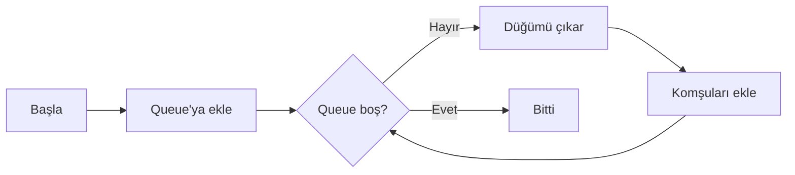
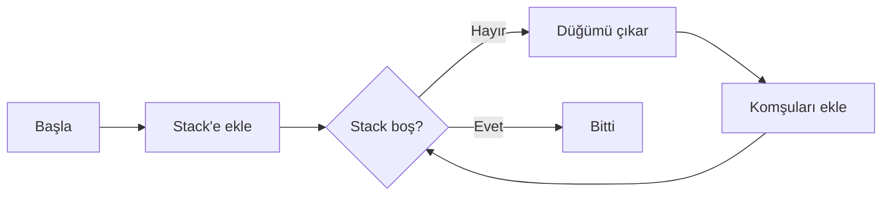
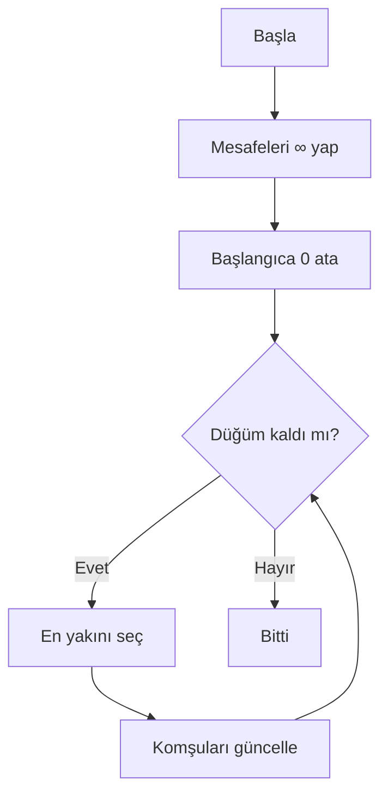
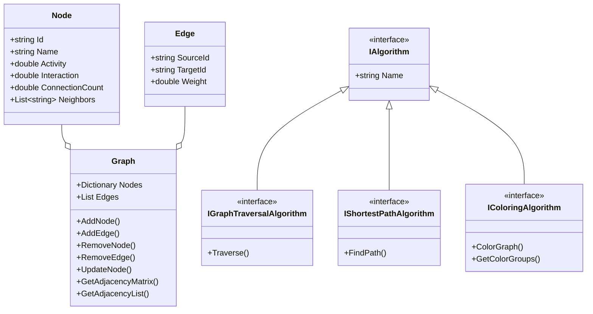

<div align="center">

# 🌐 Sosyal Ağ Analizi ve Görselleştirme

[](https://dotnet.microsoft.com/)
[](https://docs.microsoft.com/wpf/)
[](https://docs.microsoft.com/dotnet/csharp/)
[](LICENSE)

**Graf algoritmaları ile sosyal ağ analizi yapan modern bir masaüstü uygulaması**

[✨ Özellikler](#-özellikler) •
[🚀 Kurulum](#-kurulum) •
[📖 Kullanım](#-kullanım) •
[🔬 Algoritmalar](#-algoritmalar) •
[� Ekran Görüntüleri](#-ekran-görüntüleri) •
[�📊 Test Sonuçları](#-test-sonuçları)

---

</div>

## 📋 Proje Bilgileri

| | |
|---|---|
| **📛 Proje Adı** | Sosyal Ağ Analizi ve Görselleştirme Uygulaması |
| **👥 Grup** | 40. Grup |
| **👨‍💻 Ekip Üyeleri** | Muhammed Emir Karaman (231307093) <br> Nuh Regaib Ünsal (231307037) |
| **📚 Ders** | Yazılım Geliştirme Laboratuvarı-I (Lab Proje II) |
| **📅 Tarih** | Ocak 2026 |

---

## 🎯 Proje Amacı

Bu proje, sosyal ağ verilerini analiz etmek, görselleştirmek ve çeşitli graf algoritmalarını uygulamak amacıyla geliştirilmiştir. Kullanıcılar ve bağlantılar bir graf yapısı olarak modellenmiş, çeşitli algoritmalar ile analiz edilmiş ve görselleştirilmiştir.

### Hedefler

- ✅ Graf veri yapılarını kullanarak sosyal ağları modellemek
- ✅ BFS, DFS, Dijkstra, A* gibi temel graf algoritmalarını uygulamak
- ✅ Bağlı bileşenleri tespit etmek
- ✅ Merkezilik analizi yapmak
- ✅ Welsh-Powell algoritması ile graf renklendirme yapmak
- ✅ Modern ve kullanıcı dostu arayüz ile görselleştirme

---

## ✨ Özellikler

<table>
<tr>
<td width="50%">

### 📁 Veri İşlemleri
- ✅ CSV formatında yükleme/kaydetme
- ✅ JSON formatında yükleme/kaydetme
- ✅ Komşuluk matrisi export
- ✅ Komşuluk listesi export

</td>
<td width="50%">

### 🎨 Görselleştirme
- ✅ İnteraktif graf canvas
- ✅ Algoritma bazlı renk kodlaması
- ✅ Tıklama ile düğüm seçimi
- ✅ Rastgele yerleşim algoritması

</td>
</tr>
<tr>
<td>

### 🔧 Graf Yönetimi
- ✅ Düğüm ekleme/silme/güncelleme
- ✅ Kenar ekleme/silme
- ✅ Dinamik ağırlık hesaplama
- ✅ Yönsüz graf desteği

</td>
<td>

### ⚙️ Algoritmalar
- ✅ BFS & DFS gezinti
- ✅ Dijkstra & A* kısa yol
- ✅ Merkezilik analizi
- ✅ Bağlı bileşenler & renklendirme

</td>
</tr>
</table>

---

## � Ekran Görüntüleri

### 🖥️ Ana Arayüz

Uygulama modern ve kullanıcı dostu bir arayüze sahiptir. Sol tarafta graf görselleştirmesi, sağ tarafta kontrol panelleri bulunur.


---

### 🔍 Graf Gezinti Algoritmaları

#### BFS (Breadth-First Search) - Genişlik Öncelikli Arama

BFS algoritması başlangıç düğümünden itibaren önce tüm komşuları, sonra komşuların komşularını ziyaret eder. Mavi renk ile vurgulanır.


#### DFS (Depth-First Search) - Derinlik Öncelikli Arama

DFS algoritması mümkün olduğunca derine iner, geri dönüş yaparak diğer dalları keşfeder. Yeşil renk ile vurgulanır.


---

### 🛤️ En Kısa Yol Algoritmaları

#### Dijkstra Algoritması

Dijkstra algoritması ağırlıklı graflarda iki düğüm arasındaki en kısa yolu bulur. Turuncu renk ile yol vurgulanır.


#### A* (A Star) Algoritması

A* algoritması Dijkstra'nın sezgisel (heuristic) fonksiyon ile geliştirilmiş halidir. Daha az düğüm ziyaret ederek hedefe ulaşır.


---

### 📈 Analiz Algoritmaları

#### Merkezilik (Degree Centrality)

En çok bağlantıya sahip düğümleri tespit eder. Sarı renk ile Top 5 düğüm vurgulanır.


#### Bağlı Bileşenler (Connected Components)

Graf içindeki bağlı alt grafları tespit eder. Mor renk ile ilk bileşen vurgulanır.


#### Welsh-Powell Renklendirme

Komşu düğümlerin farklı renklerde olmasını sağlayan graf boyama algoritması.


---

## �🚀 Kurulum

### Gereksinimler

| Gereksinim | Versiyon |
|------------|----------|
| .NET SDK | 10.0+ |
| Windows | 10/11 |
| Visual Studio | 2022+ (opsiyonel) |

### Hızlı Başlangıç

```bash
# 1. Projeyi klonlayın
git clone https://github.com/username/SocialNetworkAnalysis.git

# 2. Proje dizinine gidin
cd SocialNetworkAnalysis

# 3. Projeyi derleyin
dotnet build

# 4. Uygulamayı çalıştırın
dotnet run --project SocialNetworkAnalysis.UI
```

---

## 📖 Kullanım

### 1️⃣ Veri Yükleme

CSV dosyası formatı:

```csv
Id,Name,Activity,Interaction,ConnectionCount,Neighbors
1,Ali,85,70,3,2;5;10
2,Veli,72,65,3,1;3;8
3,Ayşe,90,88,3,2;4;7
```

> **💡 İpucu:** `test_small.csv` (20 düğüm) veya `test_medium.csv` (100 düğüm) dosyalarını örnek olarak kullanabilirsiniz.

### 2️⃣ Algoritma Çalıştırma

1. **CSV/JSON Yükle** butonuyla bir graf yükleyin
2. Canvas üzerinde bir düğüme tıklayarak **Kaynak** seçin
3. Gerekirse ikinci düğüme tıklayarak **Hedef** seçin (📍 Kaynak / 🎯 Hedef radio butonları ile mod değiştirin)
4. İlgili algoritma butonuna tıklayın
5. Sonuçlar bilgi panelinde görüntülenir ve graf üzerinde renklendirilir

### 3️⃣ Graf Düzenleme

| İşlem | Adımlar |
|-------|---------|
| **Düğüm Ekle** | `➕ Ekle` → Bilgileri girin → `Tamam` |
| **Düğüm Sil** | Düğüme tıklayın → `➖ Sil` |
| **Düğüm Güncelle** | Düğüme tıklayın → `✏️ Güncelle` |
| **Kenar Ekle** | `🔗 Kenar Ekle` → Kaynak ve hedef seçin |
| **Kenar Sil** | `✂️ Kenar Sil` → Kaynak ve hedef seçin |
| **Sıfırla** | `🔄 Sıfırla` → Tüm seçimleri ve görselleştirmeyi temizler |

---

## 🔬 Algoritmalar

### 🔍 Graf Gezinti

<details>
<summary><b>BFS (Breadth-First Search)</b></summary>

**Çalışma Mantığı:** Başlangıç düğümünden başlayarak önce tüm komşuları, sonra komşuların komşularını ziyaret eder. Queue (kuyruk) veri yapısı kullanır.

| Metrik | Değer |
|--------|-------|
| Zaman Karmaşıklığı | O(V + E) |
| Uzay Karmaşıklığı | O(V) |
| Veri Yapısı | Queue (Kuyruk) |
| Görsel Renk | 🔵 Mavi |



</details>

<details>
<summary><b>DFS (Depth-First Search)</b></summary>

**Çalışma Mantığı:** Mümkün olduğunca derine iner, geri dönüş yaparak diğer dalları keşfeder. Stack (yığın) veri yapısı kullanır.

| Metrik | Değer |
|--------|-------|
| Zaman Karmaşıklığı | O(V + E) |
| Uzay Karmaşıklığı | O(V) |
| Veri Yapısı | Stack (Yığın) |
| Görsel Renk | 🟢 Yeşil |



</details>

### 🛤️ En Kısa Yol

<details>
<summary><b>Dijkstra Algoritması</b></summary>

**Çalışma Mantığı:** Her adımda en kısa mesafeye sahip düğümü seçer ve komşularının mesafelerini günceller.

| Metrik | Değer |
|--------|-------|
| Zaman Karmaşıklığı | O(V²) / O(V log V + E)* |
| Uzay Karmaşıklığı | O(V) |
| Kullanım | Ağırlıklı graflar |
| Görsel Renk | 🟠 Turuncu yol |

> *Priority queue ile optimize edildiğinde



</details>

<details>
<summary><b>A* Algoritması</b></summary>

**Çalışma Mantığı:** Dijkstra'nın geliştirilmiş hali. Sezgisel fonksiyon ile daha az düğüm ziyaret eder.

**Formül:** `f(n) = g(n) + h(n)`

| Sembol | Açıklama |
|--------|----------|
| f(n) | Toplam maliyet tahmini |
| g(n) | Başlangıçtan n'e maliyet |
| h(n) | n'den hedefe tahmin (heuristic) |

| Metrik | Değer |
|--------|-------|
| Zaman Karmaşıklığı | O(b^d) |
| Uzay Karmaşıklığı | O(b^d) |
| Görsel Renk | 🟠 Turuncu yol |

**Heuristic Fonksiyonu:** Düğüm özellikleri (Activity, Interaction, ConnectionCount) arasındaki Öklid mesafesi kullanılır.

</details>

### 📈 Analiz Algoritmaları

<details>
<summary><b>Merkezilik (Degree Centrality)</b></summary>

Her düğümün komşu sayısını hesaplar. En yüksek değere sahip düğümler ağın merkezindedir.

| Metrik | Değer |
|--------|-------|
| Zaman Karmaşıklığı | O(V) |
| Uzay Karmaşıklığı | O(V) |
| Görsel Renk | 🟡 Sarı (Top 5) |

</details>

<details>
<summary><b>Bağlı Bileşenler</b></summary>

DFS kullanarak grafiğin tüm bağlı bileşenlerini bulur.

| Metrik | Değer |
|--------|-------|
| Zaman Karmaşıklığı | O(V + E) |
| Uzay Karmaşıklığı | O(V) |
| Görsel Renk | 🟣 Mor (ilk bileşen) |

</details>

<details>
<summary><b>Welsh-Powell Renklendirme</b></summary>

Komşu düğümlerin farklı renklerde olmasını sağlayan graf boyama algoritması.

**Adımlar:**
1. Düğümleri dereceye göre azalan sırada sırala
2. Her düğüm için komşularının renklerini kontrol et
3. En küçük uygun rengi ata

| Metrik | Değer |
|--------|-------|
| Zaman Karmaşıklığı | O(V² + E) |
| Uzay Karmaşıklığı | O(V) |
| Görsel Renk | 🎨 Çoklu renkler |

</details>

---

## 🏗️ Mimari

### Sınıf Diyagramı



### Proje Yapısı

```
📦 SocialNetworkAnalysis
├── 📂 SocialNetworkAnalysis.Core/      # İş mantığı katmanı
│   ├── 📄 Node.cs                      # Düğüm modeli
│   ├── 📄 Edge.cs                      # Kenar modeli
│   ├── 📄 Graph.cs                     # Graf veri yapısı
│   ├── 📄 IAlgorithm.cs                # Algoritma arayüzleri
│   ├── 📄 BfsAlgorithm.cs              # BFS implementasyonu
│   ├── 📄 DfsAlgorithm.cs              # DFS implementasyonu
│   ├── 📄 ShortestPathAlgorithm.cs     # Dijkstra algoritması
│   ├── 📄 AStarAlgorithm.cs            # A* algoritması
│   ├── 📄 CentralityAlgorithm.cs       # Merkezilik analizi
│   ├── 📄 ConnectedComponentsAlgorithm.cs  # Bağlı bileşenler
│   ├── 📄 WelshPowellColoringAlgorithm.cs  # Graf renklendirme
│   ├── 📄 WeightCalculator.cs          # Dinamik ağırlık hesaplama
│   ├── 📄 FileService.cs               # CSV dosya işlemleri
│   └── 📄 JsonFileService.cs           # JSON dosya işlemleri
│
├── 📂 SocialNetworkAnalysis.UI/        # Kullanıcı arayüzü katmanı
│   ├── 📄 MainWindow.xaml              # Ana pencere tasarımı
│   ├── 📄 MainWindow.xaml.cs           # Ana pencere mantığı
│   ├── 📄 NodeDialog.xaml              # Düğüm ekleme/güncelleme dialogu
│   ├── 📄 EdgeDialog.xaml              # Kenar ekleme/silme dialogu
│   └── 📄 App.xaml                     # Uygulama ayarları
│
├── 📂 SS/                              # Ekran görüntüleri
│   ├── 🖼️ Arayüz.png
│   ├── 🖼️ BFS.png
│   ├── 🖼️ DFS.png
│   ├── 🖼️ Dijkstra.png
│   ├── 🖼️ A'.png
│   ├── 🖼️ Merkez.png
│   ├── 🖼️ Bileşen.png
│   └── 🖼️ Renk.png
│
├── 📄 test_small.csv                   # 20 düğümlük test verisi
├── 📄 test_medium.csv                  # 100 düğümlük test verisi
├── � TEST_SONUCLARI.md                # Detaylı test sonuçları
└── 📄 README.md                        # Bu dosya
```

---

## 🧮 Dinamik Ağırlık Hesaplama

Kenar ağırlıkları düğüm özelliklerine göre otomatik hesaplanır:

$$Weight_{i,j} = \frac{1}{1 + \sqrt{(A_i - A_j)^2 + (I_i - I_j)^2 + (C_i - C_j)^2}}$$

| Değişken | Açıklama |
|----------|----------|
| A | Activity (Etkinlik puanı) |
| I | Interaction (Etkileşim puanı) |
| C | ConnectionCount (Bağlantı sayısı) |

> **Not:** Benzer özelliklere sahip düğümler arasındaki ağırlık **daha yüksek** (daha güçlü bağ), farklı özellikli düğümler arasındaki ağırlık **daha düşük** olur.

---

## 📊 Test Sonuçları

### Performans Özeti

| Algoritma | 20 Düğüm | 100 Düğüm | Ölçeklenme |
|-----------|:--------:|:---------:|:----------:|
| **BFS** | 1-2 ms | 4-6 ms | ✅ Mükemmel |
| **DFS** | 1-2 ms | 4-6 ms | ✅ Mükemmel |
| **Dijkstra** | 2-3 ms | 15-25 ms | ✅ İyi |
| **A*** | 2-3 ms | 12-20 ms | ✅ İyi |
| **Merkezilik** | 1 ms | 3-5 ms | ✅ Mükemmel |
| **Bağlı Bileşenler** | 1-2 ms | 8-12 ms | ✅ İyi |
| **Welsh-Powell** | 3-4 ms | 25-40 ms | ✅ Kabul edilebilir |

### Hata Kontrolü

| Test Senaryosu | Durum |
|----------------|:-----:|
| Aynı ID'li düğüm ekleme | ✅ Engellendi |
| Self-loop oluşturma | ✅ Engellendi |
| Geçersiz düğüm ID'si ile kenar | ✅ Hata mesajı |
| Tekrarlanan kenar ekleme | ✅ Engellendi |
| Boş ID ile düğüm ekleme | ✅ Kontrol edildi |

> 📋 **Detaylı sonuçlar:** [TEST_SONUCLARI.md](TEST_SONUCLARI.md)

---

## 🎨 Algoritma Renk Kodları

| Algoritma | Renk | Açıklama |
|-----------|------|----------|
| **BFS** | 🔵 Mavi | Ziyaret edilen düğümler |
| **DFS** | 🟢 Yeşil | Ziyaret edilen düğümler |
| **Dijkstra** | 🟠 Turuncu | Bulunan en kısa yol |
| **A*** | 🟠 Turuncu | Bulunan en kısa yol |
| **Merkezilik** | 🟡 Sarı | En merkezi 5 düğüm |
| **Bileşenler** | 🟣 Mor | İlk bağlı bileşen |
| **Renklendirme** | 🎨 Çoklu | Komşu olmayan gruplar |

---

## 🔮 Gelecek Geliştirmeler

- [ ] Force-directed layout algoritması
- [ ] Zoom ve pan özellikleri
- [ ] Betweenness/Closeness centrality
- [ ] Louvain topluluk tespiti
- [ ] Animasyonlu algoritma görselleştirme
- [ ] Büyük veri optimizasyonları
- [ ] Graf veritabanı entegrasyonu

---

## 📚 Kaynaklar

- [.NET Documentation](https://docs.microsoft.com/dotnet/)
- [WPF Documentation](https://docs.microsoft.com/wpf/)
- [Graph Algorithms - Wikipedia](https://en.wikipedia.org/wiki/Graph_algorithm)
- [Dijkstra's Algorithm](https://en.wikipedia.org/wiki/Dijkstra%27s_algorithm)
- [A* Search Algorithm](https://en.wikipedia.org/wiki/A*_search_algorithm)
- [Welsh-Powell Algorithm](https://en.wikipedia.org/wiki/Graph_coloring)

---

<div align="center">

## � Lisans

Bu proje **eğitim amaçlı** geliştirilmiştir.

---

**Made with ❤️ by Group 40**

*Yazılım Geliştirme Laboratuvarı-I • Ocak 2026*

</div>
