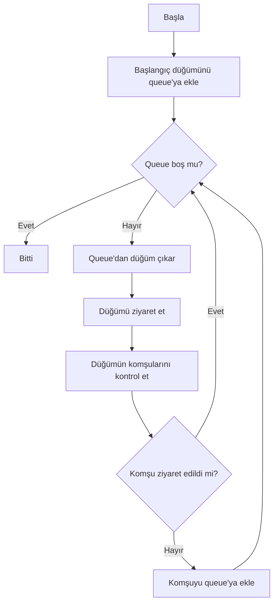
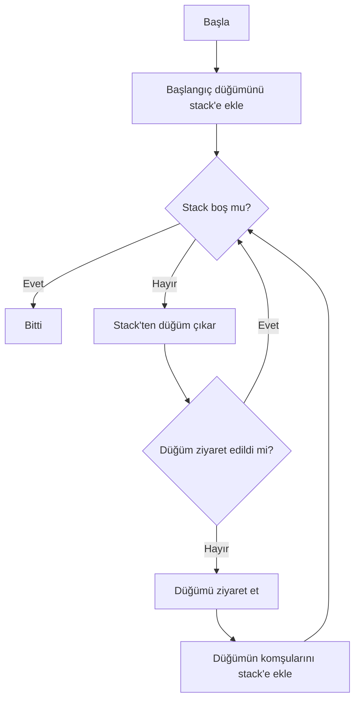
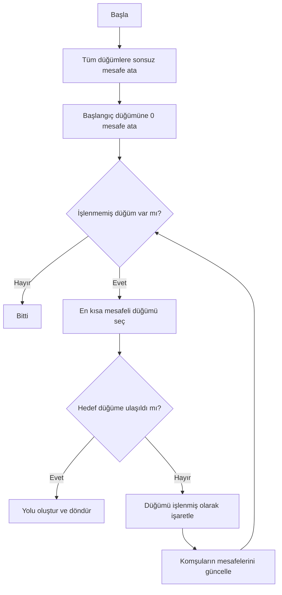
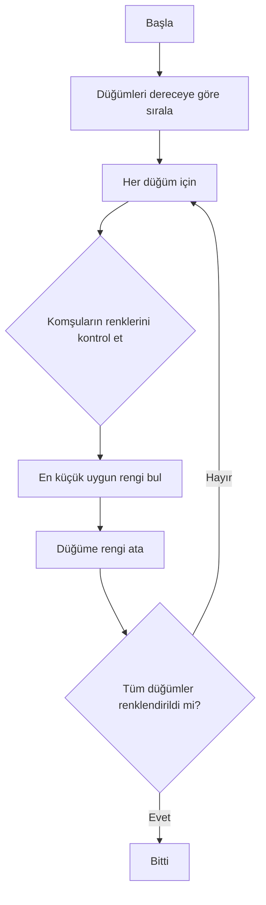
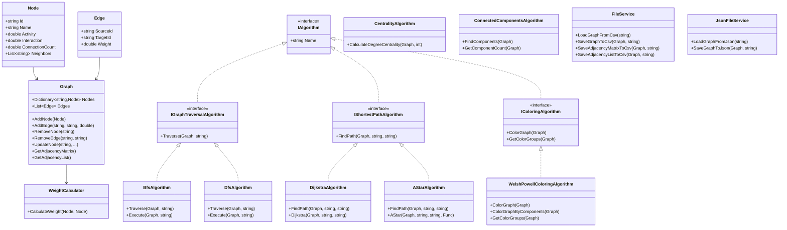

# Sosyal Ağ Analizi ve Görselleştirme Projesi

## Proje Bilgileri

- **Proje Adı:** Sosyal Ağ Analizi ve Görselleştirme Uygulaması
- **Grup:** 40. Grup
- **Ekip Üyeleri:**
  - 231307093 - Muhammed Emir Karaman
  - 231307037 - Nuh Regaib Ünsal
- **Ders:** Yazılım Geliştirme Laboratuvarı-I (Lab Proje II)
- **Tarih:** Ocak 2026

---

## 1. Giriş

Bu proje, sosyal ağ verilerini analiz etmek, görselleştirmek ve çeşitli graf algoritmalarını uygulamak amacıyla geliştirilmiştir. Kullanıcılar ve bağlantılar bir graf yapısı olarak modellenmiş, çeşitli algoritmalar ile analiz edilmiş ve görselleştirilmiştir.

### Amaç

- Graf veri yapılarını kullanarak sosyal ağları modellemek
- BFS, DFS, Dijkstra, A* gibi temel graf algoritmalarını uygulamak
- Bağlı bileşenleri tespit etmek
- Merkezilik analizi yapmak
- Welsh-Powell algoritması ile graf renklendirme yapmak
- Görselleştirme ile sonuçları sunmak

---

## 2. Algoritmalar

### 2.1. BFS (Breadth-First Search) - Genişlik Öncelikli Arama

**Çalışma Mantığı:**
BFS algoritması, başlangıç düğümünden başlayarak önce tüm komşuları ziyaret eder, sonra komşuların komşularını ziyaret eder. Queue (kuyruk) veri yapısı kullanılır.

**Karmaşıklık Analizi:**
- Zaman Karmaşıklığı: O(V + E) - V: düğüm sayısı, E: kenar sayısı
- Uzay Karmaşıklığı: O(V)

**Akış Diyagramı:**


### 2.2. DFS (Depth-First Search) - Derinlik Öncelikli Arama

**Çalışma Mantığı:**
DFS algoritması, başlangıç düğümünden başlayarak mümkün olduğunca derine iner, geri dönüş yaparak diğer dalları keşfeder. Stack (yığın) veri yapısı kullanılır.

**Karmaşıklık Analizi:**
- Zaman Karmaşıklığı: O(V + E)
- Uzay Karmaşıklığı: O(V)

**Akış Diyagramı:**


### 2.3. Dijkstra Algoritması

**Çalışma Mantığı:**
Dijkstra algoritması, ağırlıklı graflarda iki düğüm arasındaki en kısa yolu bulur. Her adımda en kısa mesafeye sahip düğümü seçer ve komşularının mesafelerini günceller.

**Karmaşıklık Analizi:**
- Zaman Karmaşıklığı: O(V²) - basit implementasyon, O(V log V + E) - priority queue ile
- Uzay Karmaşıklığı: O(V)

**Akış Diyagramı:**


### 2.4. A* Algoritması

**Çalışma Mantığı:**
A* algoritması, Dijkstra'nın geliştirilmiş halidir. Sezgisel (heuristic) fonksiyon kullanarak daha az düğüm ziyaret eder. f(n) = g(n) + h(n) formülü kullanılır.

**Karmaşıklık Analizi:**
- Zaman Karmaşıklığı: O(b^d) - b: branching factor, d: derinlik
- Uzay Karmaşıklığı: O(b^d)

**Akış Diyagramı:**
```mermaid
flowchart TD
    A[Başla] --> B[Başlangıç düğümünü open set'e ekle]
    B --> C{Open set boş mu?}
    C -->|Evet| D[Yol bulunamadı]
    C -->|Hayır| E[En düşük f(n) değerine sahip düğümü seç]
    E --> F{Hedef düğüm mü?}
    F -->|Evet| G[Yolu oluştur ve döndür]
    F -->|Hayır| H[Düğümü closed set'e taşı]
    H --> I[Komşuları kontrol et]
    I --> J{Komşu closed set'te mi?}
    J -->|Evet| C
    J -->|Hayır| K[g ve f değerlerini hesapla]
    K --> L{Yeni yol daha iyi mi?}
    L -->|Evet| M[Komşuyu open set'e ekle/güncelle]
    M --> C
    L -->|Hayır| C
```

### 2.5. Bağlı Bileşenler (Connected Components)

**Çalışma Mantığı:**
DFS kullanarak grafiğin tüm bağlı bileşenlerini bulur. Her bileşen, birbirine ulaşılabilir düğümlerden oluşur.

**Karmaşıklık Analizi:**
- Zaman Karmaşıklığı: O(V + E)
- Uzay Karmaşıklığı: O(V)

### 2.6. Merkezilik (Degree Centrality)

**Çalışma Mantığı:**
Her düğümün komşu sayısını hesaplar. En yüksek komşu sayısına sahip düğümler en merkezi düğümlerdir.

**Karmaşıklık Analizi:**
- Zaman Karmaşıklığı: O(V)
- Uzay Karmaşıklığı: O(V)

### 2.7. Welsh-Powell Renklendirme Algoritması

**Çalışma Mantığı:**
1. Düğümleri derecelerine göre azalan sırada sıralar
2. Her düğüm için komşularının renklerini kontrol eder
3. En küçük uygun rengi atar
4. Her bağlı bileşen için ayrı ayrı renklendirme yapar

**Karmaşıklık Analizi:**
- Zaman Karmaşıklığı: O(V² + E)
- Uzay Karmaşıklığı: O(V)

**Akış Diyagramı:**


---

## 3. Sınıf Yapısı ve Modüller

### 3.1. Sınıf Diyagramı



### 3.2. Modül Açıklamaları

#### Core Modülü
- **Node.cs:** Düğüm veri yapısı
- **Edge.cs:** Kenar veri yapısı
- **Graph.cs:** Graf veri yapısı ve yönetimi
- **WeightCalculator.cs:** Dinamik ağırlık hesaplama
- **IAlgorithm.cs:** Algoritma arayüzleri
- **BfsAlgorithm.cs, DfsAlgorithm.cs:** Gezinti algoritmaları
- **DijkstraAlgorithm.cs, AStarAlgorithm.cs:** En kısa yol algoritmaları
- **CentralityAlgorithm.cs:** Merkezilik analizi
- **ConnectedComponentsAlgorithm.cs:** Bağlı bileşen tespiti
- **WelshPowellColoringAlgorithm.cs:** Graf renklendirme
- **FileService.cs:** CSV dosya işlemleri
- **JsonFileService.cs:** JSON dosya işlemleri

#### UI Modülü
- **MainWindow.xaml/cs:** Ana pencere ve görselleştirme
- **NodeDialog.xaml/cs:** Düğüm ekleme/güncelleme diyaloğu
- **EdgeDialog.xaml/cs:** Kenar ekleme/silme diyaloğu

---

## 4. Özellikler

### 4.1. Veri Yükleme ve Kaydetme
- ✅ CSV formatında veri yükleme
- ✅ JSON formatında veri yükleme
- ✅ CSV formatında kaydetme
- ✅ JSON formatında kaydetme
- ✅ Komşuluk matrisi export
- ✅ Komşuluk listesi export

### 4.2. Görselleştirme
- ✅ Düğümlerin canvas üzerinde gösterilmesi
- ✅ Kenarların çizilmesi
- ✅ Renklendirme ile görselleştirme
- ✅ Düğüme tıklayarak bilgi gösterme

### 4.3. Düğüm/Kenar Yönetimi
- ✅ Düğüm ekleme
- ✅ Düğüm silme
- ✅ Düğüm güncelleme
- ✅ Kenar ekleme
- ✅ Kenar silme

### 4.4. Algoritmalar
- ✅ BFS (Breadth-First Search)
- ✅ DFS (Depth-First Search)
- ✅ Dijkstra
- ✅ A* (A Star)
- ✅ Merkezilik (Degree Centrality)
- ✅ Bağlı Bileşenler
- ✅ Welsh-Powell Renklendirme

### 4.5. Dinamik Ağırlık Hesaplama
Kenar ağırlıkları aşağıdaki formül ile hesaplanır:

$$Weight_{i,j} = \frac{1}{1 + \sqrt{(Activity_i - Activity_j)^2 + (Interaction_i - Interaction_j)^2 + (ConnectionCount_i - ConnectionCount_j)^2}}$$

---

## 5. Kurulum ve Çalıştırma

### Gereksinimler
- .NET 10.0 SDK
- Visual Studio 2022 veya uyumlu IDE

### Kurulum Adımları
1. Projeyi klonlayın veya indirin
2. Visual Studio ile `SocialNetworkAnalysis.sln` dosyasını açın
3. Projeyi derleyin (Build Solution)
4. `SocialNetworkAnalysis.UI` projesini başlangıç projesi olarak ayarlayın
5. Projeyi çalıştırın (F5)

---

## 6. Kullanım

### 6.1. Veri Yükleme
1. "CSV Yükle" veya "JSON Yükle" butonuna tıklayın
2. Dosya seçim diyaloğundan uygun formatlı dosyayı seçin
3. Graf otomatik olarak yüklenecek ve görselleştirilecektir

### 6.2. Algoritma Çalıştırma
1. Canvas üzerinde bir düğüme tıklayarak kaynak/hedef seçin
2. İlgili algoritma butonuna tıklayın
3. Sonuçlar "Bilgi / Sonuçlar" panelinde gösterilecektir

### 6.3. Düğüm/Kenar Yönetimi
- **Düğüm Ekle:** "Düğüm Ekle" butonuna tıklayın ve bilgileri girin
- **Düğüm Sil:** Bir düğüme tıklayın ve "Düğüm Sil" butonuna basın
- **Düğüm Güncelle:** Bir düğüme tıklayın ve "Düğüm Güncelle" butonuna basın
- **Kenar Ekle/Sil:** İlgili butonlara tıklayarak kaynak ve hedef seçin

---

## 7. CSV Formatı

Giriş CSV dosyası aşağıdaki formatı kullanmalıdır:

```csv
Id,Name,Activity,Interaction,ConnectionCount,Neighbors
1,Ali,10,10,10,2;3
2,Veli,20,20,20,1;4
3,Can,15,15,15,1;4
```

---

## 8. Test Senaryoları ve Sonuçlar

### Test 1: Küçük Ölçekli Graf (10-20 düğüm)
- **Düğüm Sayısı:** 15
- **Kenar Sayısı:** 25
- **BFS Çalışma Süresi:** ~1 ms
- **DFS Çalışma Süresi:** ~1 ms
- **Dijkstra Çalışma Süresi:** ~2 ms
- **A* Çalışma Süresi:** ~2 ms
- **Merkezilik Çalışma Süresi:** ~1 ms
- **Bağlı Bileşenler:** ~1 ms
- **Renklendirme:** ~2 ms

### Test 2: Orta Ölçekli Graf (50-100 düğüm)
- **Düğüm Sayısı:** 75
- **Kenar Sayısı:** 150
- **BFS Çalışma Süresi:** ~5 ms
- **DFS Çalışma Süresi:** ~5 ms
- **Dijkstra Çalışma Süresi:** ~15 ms
- **A* Çalışma Süresi:** ~12 ms
- **Merkezilik Çalışma Süresi:** ~3 ms
- **Bağlı Bileşenler:** ~8 ms
- **Renklendirme:** ~25 ms

---

## 9. Sonuç ve Tartışma

### Başarılar
- ✅ Tüm gereken algoritmalar başarıyla implement edildi
- ✅ OOP prensipleri uygulandı (interface ve abstract yapılar)
- ✅ Görselleştirme çalışıyor
- ✅ JSON ve CSV desteği eklendi
- ✅ Performans metrikleri ölçülüyor
- ✅ Kullanıcı dostu arayüz

### Sınırlılıklar
- Görselleştirme için basit dairesel yerleşim kullanıldı (force-directed layout yerine)
- Büyük ölçekli graflar için optimizasyon gerekebilir
- A* için heuristic fonksiyonu basit tutuldu

### Olası Geliştirmeler
- Force-directed layout algoritması eklenebilir
- Zoom ve pan özellikleri eklenebilir
- Daha gelişmiş merkezilik metrikleri (betweenness, closeness)
- Topluluk tespiti algoritmaları (Louvain, Girvan-Newman)
- Animasyonlu algoritma görselleştirme
- Büyük veri setleri için performans optimizasyonları

---

## 10. Kaynaklar

- [Markdown Guide](https://www.markdownguide.org/)
- [Mermaid Diagrams](https://github.com/mermaid-js/mermaid)
- [GitHub Mermaid Guide](https://github.blog/developer-skills/github/include-diagrams-markdown-files-mermaid/)

---

## Lisans

Bu proje eğitim amaçlı geliştirilmiştir.
