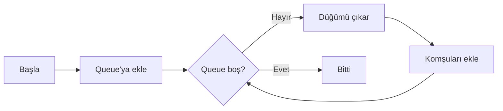
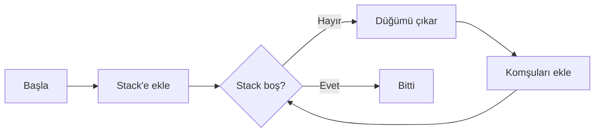
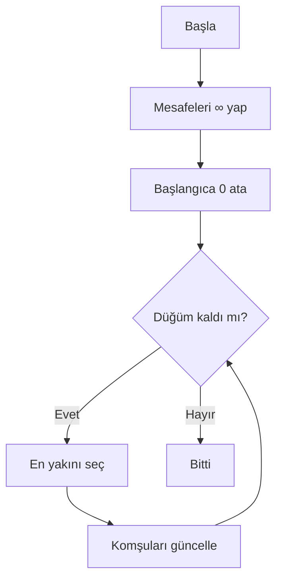
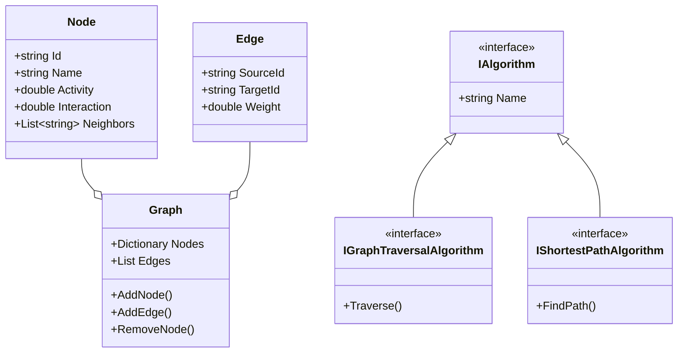

<div align="center">

# 🌐 Sosyal Ağ Analizi ve Görselleştirme

[](https://dotnet.microsoft.com/)
[](https://docs.microsoft.com/wpf/)
[](LICENSE)

**Graf algoritmaları ile sosyal ağ analizi yapan modern bir masaüstü uygulaması**

[✨ Özellikler](#-özellikler) •
[🚀 Kurulum](#-kurulum) •
[📖 Kullanım](#-kullanım) •
[🔬 Algoritmalar](#-algoritmalar) •
[📊 Testler](#-test-sonuçları)

---

</div>

## 📋 Proje Bilgileri

| | |
|---|---|
| **📛 Proje Adı** | Sosyal Ağ Analizi ve Görselleştirme Uygulaması |
| **👥 Grup** | 40. Grup |
| **👨‍💻 Ekip** | Muhammed Emir Karaman (231307093) <br> Nuh Regaib Ünsal (231307037) |
| **📚 Ders** | Yazılım Geliştirme Laboratuvarı-I |
| **📅 Tarih** | Ocak 2026 |

---

## ✨ Özellikler

<table>
<tr>
<td width="50%">

### 📁 Veri İşlemleri
- ✅ CSV formatında yükleme/kaydetme
- ✅ JSON formatında yükleme/kaydetme
- ✅ Komşuluk matrisi export
- ✅ Komşuluk listesi export

</td>
<td width="50%">

### 🎨 Görselleştirme
- ✅ İnteraktif graf canvas
- ✅ Düğüm renklendirme
- ✅ Tıklama ile düğüm seçimi
- ✅ Dairesel yerleşim algoritması

</td>
</tr>
<tr>
<td>

### 🔧 Graf Yönetimi
- ✅ Düğüm ekleme/silme/güncelleme
- ✅ Kenar ekleme/silme
- ✅ Dinamik ağırlık hesaplama
- ✅ Yönsüz graf desteği

</td>
<td>

### ⚙️ Algoritmalar
- ✅ BFS & DFS gezinti
- ✅ Dijkstra & A* kısa yol
- ✅ Merkezilik analizi
- ✅ Bağlı bileşenler & renklendirme

</td>
</tr>
</table>

---

## 🚀 Kurulum

### Gereksinimler

| Gereksinim | Versiyon |
|------------|----------|
| .NET SDK | 10.0+ |
| Windows | 10/11 |
| Visual Studio | 2022+ (opsiyonel) |

### Hızlı Başlangıç

```bash
# 1. Projeyi klonlayın
git clone https://github.com/username/SocialNetworkAnalysis.git

# 2. Proje dizinine gidin
cd SocialNetworkAnalysis

# 3. Uygulamayı çalıştırın
dotnet run --project SocialNetworkAnalysis.UI
```

---

## 📖 Kullanım

### 1️⃣ Veri Yükleme

```csv
Id,Name,Activity,Interaction,ConnectionCount,Neighbors
1,Ali,10,10,10,2;3
2,Veli,20,20,20,1;4
3,Can,15,15,15,1;4
```

> **💡 İpucu:** `test_small.csv` veya `test_medium.csv` dosyalarını örnek olarak kullanabilirsiniz.

### 2️⃣ Algoritma Çalıştırma

1. Canvas üzerinde bir düğüme tıklayarak **kaynak** seçin
2. Gerekirse ikinci düğüme tıklayarak **hedef** seçin
3. İlgili algoritma butonuna tıklayın
4. Sonuçlar bilgi panelinde görüntülenir

### 3️⃣ Graf Düzenleme

| İşlem | Adımlar |
|-------|---------|
| **Düğüm Ekle** | `Düğüm Ekle` → Bilgileri girin → `Tamam` |
| **Düğüm Sil** | Düğüme tıklayın → `Düğüm Sil` |
| **Kenar Ekle** | `Kenar Ekle` → Kaynak ve hedef seçin |

---

## 🔬 Algoritmalar

### 🔍 Graf Gezinti

<details>
<summary><b>BFS (Breadth-First Search)</b></summary>

**Çalışma Mantığı:** Başlangıç düğümünden başlayarak önce tüm komşuları, sonra komşuların komşularını ziyaret eder.

| Metrik | Değer |
|--------|-------|
| Zaman Karmaşıklığı | O(V + E) |
| Uzay Karmaşıklığı | O(V) |
| Veri Yapısı | Queue (Kuyruk) |



</details>

<details>
<summary><b>DFS (Depth-First Search)</b></summary>

**Çalışma Mantığı:** Mümkün olduğunca derine iner, geri dönüş yaparak diğer dalları keşfeder.

| Metrik | Değer |
|--------|-------|
| Zaman Karmaşıklığı | O(V + E) |
| Uzay Karmaşıklığı | O(V) |
| Veri Yapısı | Stack (Yığın) |



</details>

### 🛤️ En Kısa Yol

<details>
<summary><b>Dijkstra Algoritması</b></summary>

**Çalışma Mantığı:** Her adımda en kısa mesafeye sahip düğümü seçer ve komşularının mesafelerini günceller.

| Metrik | Değer |
|--------|-------|
| Zaman Karmaşıklığı | O(V²) / O(V log V + E)* |
| Uzay Karmaşıklığı | O(V) |
| Kullanım | Ağırlıklı graflar |

> *Priority queue ile optimize edildiğinde



</details>

<details>
<summary><b>A* Algoritması</b></summary>

**Çalışma Mantığı:** Dijkstra'nın geliştirilmiş hali. Sezgisel fonksiyon ile daha az düğüm ziyaret eder.

**Formül:** `f(n) = g(n) + h(n)`

| Sembol | Açıklama |
|--------|----------|
| f(n) | Toplam maliyet tahmini |
| g(n) | Başlangıçtan n'e maliyet |
| h(n) | n'den hedefe tahmin |

</details>

### 📈 Analiz Algoritmaları

<details>
<summary><b>Merkezilik (Degree Centrality)</b></summary>

Her düğümün komşu sayısını hesaplar. En yüksek değere sahip düğümler ağın merkezindedir.

| Metrik | Değer |
|--------|-------|
| Zaman Karmaşıklığı | O(V) |
| Uzay Karmaşıklığı | O(V) |

</details>

<details>
<summary><b>Bağlı Bileşenler</b></summary>

DFS kullanarak grafiğin tüm bağlı bileşenlerini bulur.

| Metrik | Değer |
|--------|-------|
| Zaman Karmaşıklığı | O(V + E) |
| Uzay Karmaşıklığı | O(V) |

</details>

<details>
<summary><b>Welsh-Powell Renklendirme</b></summary>

Komşu düğümlerin farklı renklerde olmasını sağlayan graf boyama algoritması.

**Adımlar:**
1. Düğümleri dereceye göre sırala
2. Her düğüm için en küçük uygun rengi bul
3. Rengi ata

| Metrik | Değer |
|--------|-------|
| Zaman Karmaşıklığı | O(V² + E) |
| Uzay Karmaşıklığı | O(V) |

</details>

---

## 🏗️ Mimari

### Sınıf Diyagramı



### Proje Yapısı

```
📦 SocialNetworkAnalysis
├── 📂 SocialNetworkAnalysis.Core/
│   ├── 📄 Node.cs              # Düğüm modeli
│   ├── 📄 Edge.cs              # Kenar modeli
│   ├── 📄 Graph.cs             # Graf veri yapısı
│   ├── 📄 BfsAlgorithm.cs      # BFS implementasyonu
│   ├── 📄 DfsAlgorithm.cs      # DFS implementasyonu
│   ├── 📄 ShortestPathAlgorithm.cs  # Dijkstra
│   ├── 📄 AStarAlgorithm.cs    # A* algoritması
│   ├── 📄 CentralityAlgorithm.cs
│   ├── 📄 ConnectedComponentsAlgorithm.cs
│   ├── 📄 WelshPowellColoringAlgorithm.cs
│   ├── 📄 FileService.cs       # CSV işlemleri
│   └── 📄 JsonFileService.cs   # JSON işlemleri
│
└── 📂 SocialNetworkAnalysis.UI/
    ├── 📄 MainWindow.xaml      # Ana pencere UI
    ├── 📄 MainWindow.xaml.cs   # UI mantığı
    ├── 📄 NodeDialog.xaml      # Düğüm ekleme dialogu
    └── 📄 EdgeDialog.xaml      # Kenar ekleme dialogu
```

---

## 📊 Test Sonuçları

### Performans Karşılaştırması

| Algoritma | 20 Düğüm | 100 Düğüm | Ölçeklenme |
|-----------|:--------:|:---------:|:----------:|
| **BFS** | 1-2 ms | 4-6 ms | ✅ Mükemmel |
| **DFS** | 1-2 ms | 4-6 ms | ✅ Mükemmel |
| **Dijkstra** | 2-3 ms | 15-25 ms | ✅ İyi |
| **A*** | 2-3 ms | 12-20 ms | ✅ İyi |
| **Merkezilik** | 1 ms | 3-5 ms | ✅ Mükemmel |
| **Bağlı Bileşenler** | 1-2 ms | 8-12 ms | ✅ İyi |
| **Welsh-Powell** | 3-4 ms | 25-40 ms | ✅ Kabul edilebilir |

### Hata Kontrolü Testleri

| Test Senaryosu | Durum |
|----------------|:-----:|
| Aynı ID'li düğüm ekleme | ✅ Engellendi |
| Self-loop oluşturma | ✅ Engellendi |
| Geçersiz düğüm ID'si | ✅ Hata mesajı |
| Tekrarlanan kenar | ✅ Engellendi |
| Boş ID ile düğüm ekleme | ✅ Kontrol edildi |

> 📋 **Detaylı sonuçlar:** [TEST_SONUCLARI.md](TEST_SONUCLARI.md)

---

## 🧮 Dinamik Ağırlık Hesaplama

Kenar ağırlıkları aşağıdaki formül ile hesaplanır:

$$Weight_{i,j} = \frac{1}{1 + \sqrt{(A_i - A_j)^2 + (I_i - I_j)^2 + (C_i - C_j)^2}}$$

| Değişken | Açıklama |
|----------|----------|
| A | Activity (Etkinlik puanı) |
| I | Interaction (Etkileşim puanı) |
| C | ConnectionCount (Bağlantı sayısı) |

---

## 🔮 Gelecek Geliştirmeler

- [ ] Force-directed layout algoritması
- [ ] Zoom ve pan özellikleri
- [ ] Betweenness/Closeness centrality
- [ ] Louvain topluluk tespiti
- [ ] Animasyonlu algoritma görselleştirme
- [ ] Büyük veri optimizasyonları

---

## 📚 Kaynaklar

- [.NET Documentation](https://docs.microsoft.com/dotnet/)
- [WPF Documentation](https://docs.microsoft.com/wpf/)
- [Mermaid Diagrams](https://mermaid.js.org/)
- [Graph Algorithms](https://en.wikipedia.org/wiki/Graph_algorithm)

---

<div align="center">

📖 **Bu proje eğitim amaçlı geliştirilmiştir.**

Made with ❤️ by Group 40

</div>
