<div align="center">

# 🌐 Sosyal Ağ Analizi ve Görselleştirme

[](https://dotnet.microsoft.com/)
[](https://docs.microsoft.com/wpf/)
[](https://docs.microsoft.com/dotnet/csharp/)
[](LICENSE)

**Graf algoritmaları ile sosyal ağ analizi yapan modern bir masaüstü uygulaması**

[✨ Özellikler](#-özellikler) •
[🚀 Kurulum](#-kurulum) •
[📖 Kullanım](#-kullanım) •
[🔬 Algoritmalar](#-algoritmalar) •
[� Ekran Görüntüleri](#-ekran-görüntüleri) •
[�📊 Test Sonuçları](#-test-sonuçları)

---

</div>

## 📋 Proje Bilgileri

| | |
|---|---|
| **📛 Proje Adı** | Sosyal Ağ Analizi ve Görselleştirme Uygulaması |
| **👥 Grup** | 40. Grup |
| **👨‍💻 Ekip Üyeleri** | Muhammed Emir Karaman (231307093) <br> Nuh Regaib Ünsal (231307037) |
| **📚 Ders** | Yazılım Geliştirme Laboratuvarı-I (Lab Proje II) |
| **📅 Tarih** | Ocak 2026 |

---

## 🎯 Proje Amacı

Bu proje, sosyal ağ verilerini analiz etmek, görselleştirmek ve çeşitli graf algoritmalarını uygulamak amacıyla geliştirilmiştir. Kullanıcılar ve bağlantılar bir graf yapısı olarak modellenmiş, çeşitli algoritmalar ile analiz edilmiş ve görselleştirilmiştir.

### Hedefler

- ✅ Graf veri yapılarını kullanarak sosyal ağları modellemek
- ✅ BFS, DFS, Dijkstra, A* gibi temel graf algoritmalarını uygulamak
- ✅ Bağlı bileşenleri tespit etmek
- ✅ Merkezilik analizi yapmak
- ✅ Welsh-Powell algoritması ile graf renklendirme yapmak
- ✅ Modern ve kullanıcı dostu arayüz ile görselleştirme

---

## ✨ Özellikler

<table>
<tr>
<td width="50%">

### 📁 Veri İşlemleri
- ✅ CSV formatında yükleme/kaydetme
- ✅ JSON formatında yükleme/kaydetme
- ✅ Komşuluk matrisi export
- ✅ Komşuluk listesi export

</td>
<td width="50%">

### 🎨 Görselleştirme
- ✅ İnteraktif graf canvas
- ✅ Algoritma bazlı renk kodlaması
- ✅ Tıklama ile düğüm seçimi
- ✅ Rastgele yerleşim algoritması

</td>
</tr>
<tr>
<td>

### 🔧 Graf Yönetimi
- ✅ Düğüm ekleme/silme/güncelleme
- ✅ Kenar ekleme/silme
- ✅ Dinamik ağırlık hesaplama
- ✅ Yönsüz graf desteği

</td>
<td>

### ⚙️ Algoritmalar
- ✅ BFS & DFS gezinti
- ✅ Dijkstra & A* kısa yol
- ✅ Merkezilik analizi
- ✅ Bağlı bileşenler & renklendirme

</td>
</tr>
</table>

---

## 🖥️ Ana Arayüz

Uygulama modern ve kullanıcı dostu bir arayüze sahiptir. Sol tarafta graf görselleştirmesi, sağ tarafta kontrol panelleri bulunur.

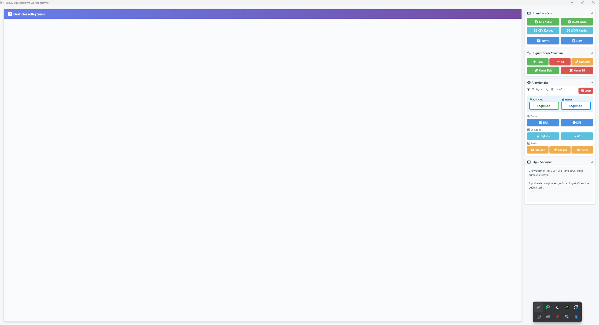

---

## �🚀 Kurulum

### Gereksinimler

| Gereksinim | Versiyon |
|------------|----------|
| .NET SDK | 10.0+ |
| Windows | 10/11 |
| Visual Studio | 2022+ (opsiyonel) |

### Hızlı Başlangıç

```bash
# 1. Projeyi klonlayın
git clone https://github.com/username/SocialNetworkAnalysis.git

# 2. Proje dizinine gidin
cd SocialNetworkAnalysis

# 3. Projeyi derleyin
dotnet build

# 4. Uygulamayı çalıştırın
dotnet run --project SocialNetworkAnalysis.UI
```

---

## 📖 Kullanım

### 1️⃣ Veri Yükleme

CSV dosyası formatı:

```csv
Id,Name,Activity,Interaction,ConnectionCount,Neighbors
1,Ali,85,70,3,2;5;10
2,Veli,72,65,3,1;3;8
3,Ayşe,90,88,3,2;4;7
```

> **💡 İpucu:** `test_small.csv` (20 düğüm) veya `test_medium.csv` (100 düğüm) dosyalarını örnek olarak kullanabilirsiniz.

### 2️⃣ Algoritma Çalıştırma

1. **CSV/JSON Yükle** butonuyla bir graf yükleyin
2. Canvas üzerinde bir düğüme tıklayarak **Kaynak** seçin
3. Gerekirse ikinci düğüme tıklayarak **Hedef** seçin (📍 Kaynak / 🎯 Hedef radio butonları ile mod değiştirin)
4. İlgili algoritma butonuna tıklayın
5. Sonuçlar bilgi panelinde görüntülenir ve graf üzerinde renklendirilir

### 3️⃣ Graf Düzenleme

| İşlem | Adımlar |
|-------|---------|
| **Düğüm Ekle** | `➕ Ekle` → Bilgileri girin → `Tamam` |
| **Düğüm Sil** | Düğüme tıklayın → `➖ Sil` |
| **Düğüm Güncelle** | Düğüme tıklayın → `✏️ Güncelle` |
| **Kenar Ekle** | `🔗 Kenar Ekle` → Kaynak ve hedef seçin |
| **Kenar Sil** | `✂️ Kenar Sil` → Kaynak ve hedef seçin |
| **Sıfırla** | `🔄 Sıfırla` → Tüm seçimleri ve görselleştirmeyi temizler |

---

## 🔬 Algoritmalar

---

### 🔵 BFS (Breadth-First Search) - Genişlik Öncelikli Arama

BFS, bir grafı **katman katman** gezer. Başlangıç düğümünden başlayarak önce tüm komşuları, sonra komşuların komşularını ziyaret eder. **Queue (kuyruk)** veri yapısı kullanır ve ağırlıksız graflarda en kısa yolu garanti eder.

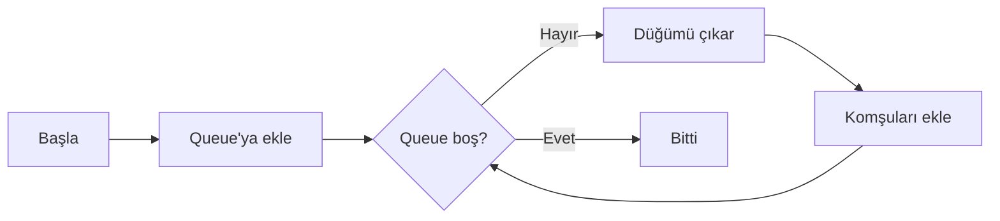

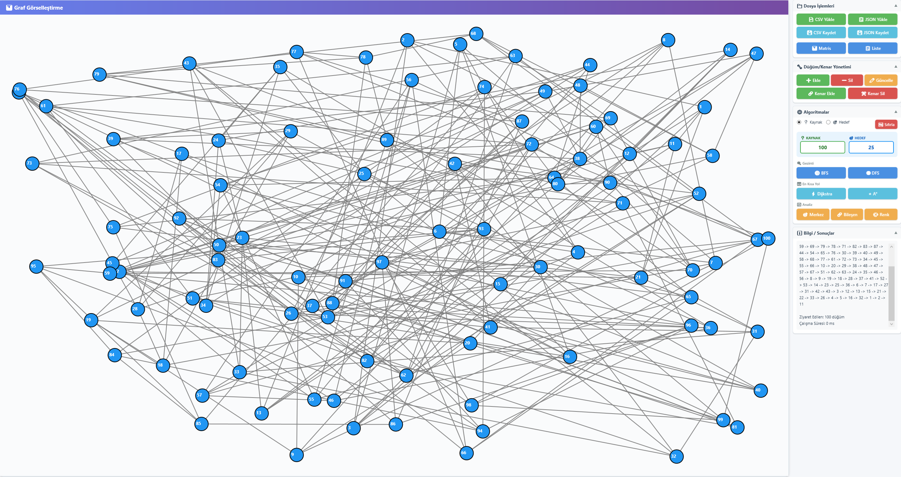

| Özellik | Değer |
|---------|-------|
| Veri Yapısı | Queue (FIFO) |
| Karmaşıklık | O(V + E) |
| Görsel | 🔵 Mavi |

---

### 🟢 DFS (Depth-First Search) - Derinlik Öncelikli Arama

DFS, bir grafı **derinlemesine** gezer. Bir yolda mümkün olduğunca ilerler, çıkmaza girdiğinde geri dönerek diğer dalları keşfeder. **Stack (yığın)** veri yapısı kullanır ve döngü tespiti, topolojik sıralama gibi işlemler için idealdir.

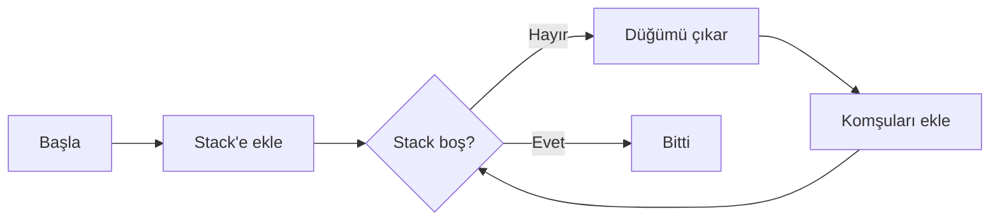

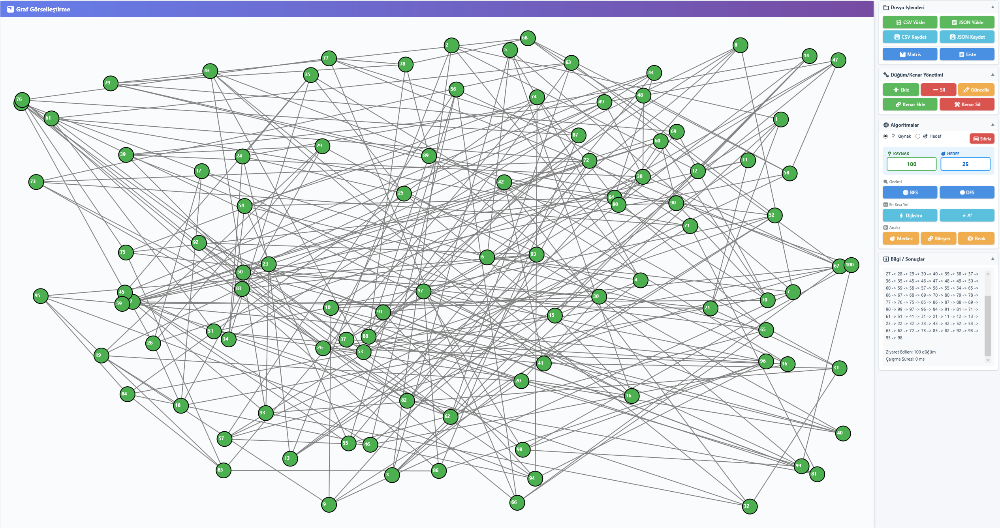

| Özellik | Değer |
|---------|-------|
| Veri Yapısı | Stack (LIFO) |
| Karmaşıklık | O(V + E) |
| Görsel | 🟢 Yeşil |

---

### ⚡ Dijkstra Algoritması

Dijkstra, ağırlıklı graflarda **en kısa yolu** bulan açgözlü bir algoritmadır. Her adımda henüz işlenmemiş düğümler arasından en kısa mesafeye sahip olanı seçer ve komşularının mesafelerini günceller. Negatif ağırlıklı kenarları desteklemez.

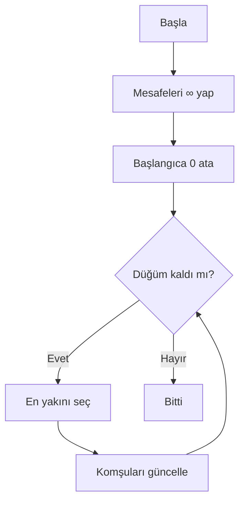

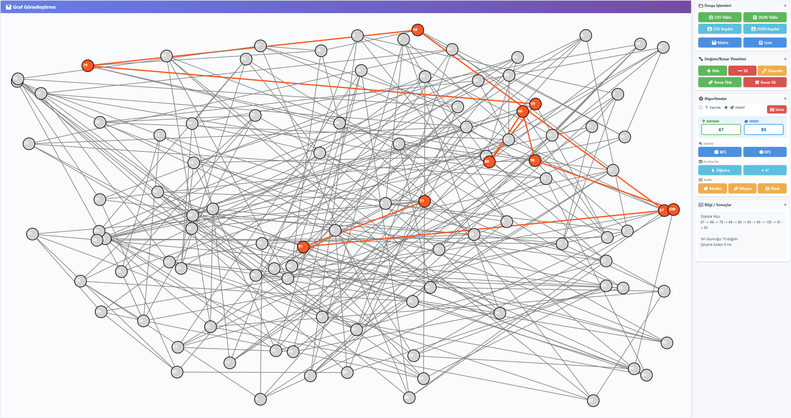

| Özellik | Değer |
|---------|-------|
| Kullanım | Ağırlıklı graflarda en kısa yol |
| Karmaşıklık | O(V²) veya O((V+E) log V) |
| Görsel | 🟠 Turuncu yol |

---

### ⭐ A* (A Star) Algoritması

A*, Dijkstra'nın **sezgisel fonksiyon (heuristic)** ile geliştirilmiş halidir. Hedefe olan tahmini mesafeyi de hesaba katarak daha az düğüm ziyaret eder. Formül: `f(n) = g(n) + h(n)` şeklindedir; g(n) gerçek maliyet, h(n) tahmini maliyettir.

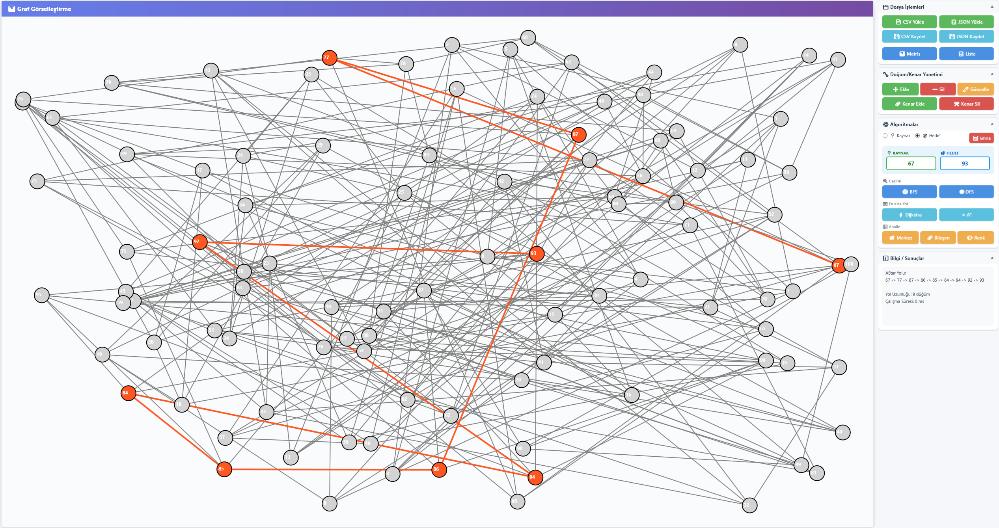

| Özellik | Değer |
|---------|-------|
| Avantaj | Dijkstra'dan daha hızlı |
| Karmaşıklık | Heuristic kalitesine bağlı |
| Görsel | 🟠 Turuncu yol |

---

### 🎯 Merkezilik (Degree Centrality)

Derece Merkeziliği, bir düğümün **kaç komşuya sahip olduğunu** ölçer. Daha fazla bağlantıya sahip düğümler ağın "merkezinde" kabul edilir. Sosyal ağlarda popülerliği gösterir.

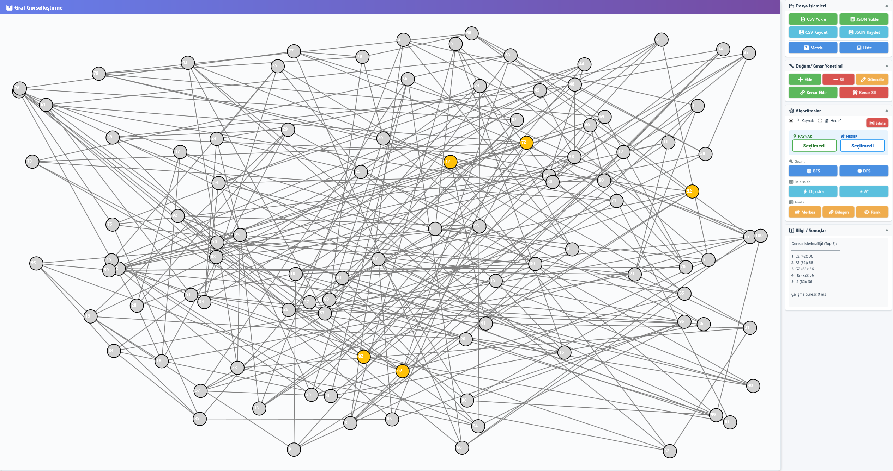

| Özellik | Değer |
|---------|-------|
| Hesaplama | Komşu sayısı |
| Karmaşıklık | O(V) |
| Görsel | 🟡 Sarı (Top 5) |

---

### 🔗 Bağlı Bileşenler (Connected Components)

Bir grafta birbirine bağlı olmayan **alt grafları** tespit eder. DFS kullanarak her bileşeni ayrı ayrı bulur. Sosyal ağlarda izole grupları, ağ analizinde kopuk bölgeleri gösterir.

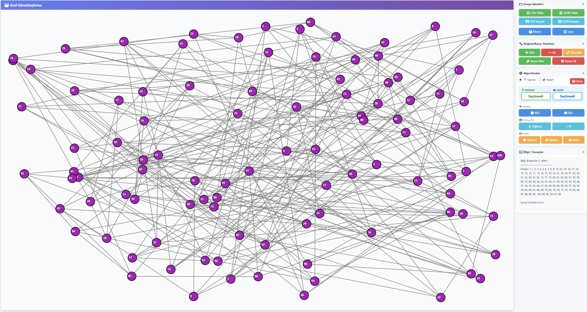

| Özellik | Değer |
|---------|-------|
| Kullanım | Alt graf tespiti |
| Karmaşıklık | O(V + E) |
| Görsel | 🟣 Mor (ilk bileşen) |

---

### 🎨 Welsh-Powell Renklendirme

Graf renklendirme, **komşu düğümlerin farklı renklerde** olmasını sağlar. Welsh-Powell, düğümleri derecelerine göre sıralayarak minimum renge yakın sonuç üretir. Çizelgeleme ve kaynak atama problemlerinde kullanılır.

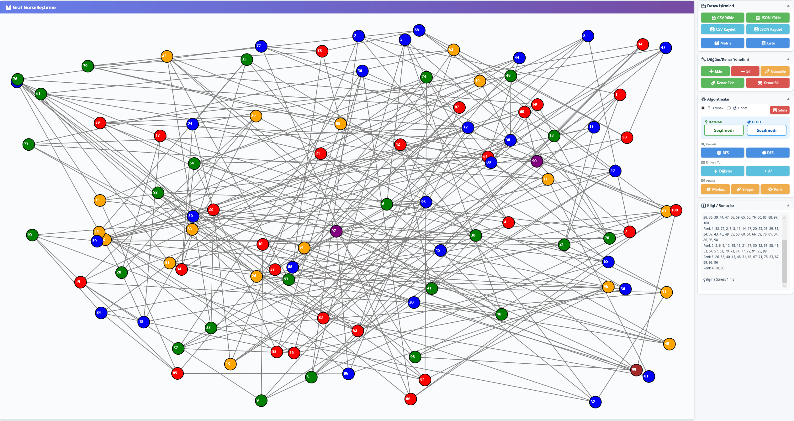

| Özellik | Değer |
|---------|-------|
| Yöntem | Derece bazlı sıralama + açgözlü atama |
| Karmaşıklık | O(V² + E) |
| Görsel | 🎨 Çoklu renkler |

---


### Sınıf Diyagramı

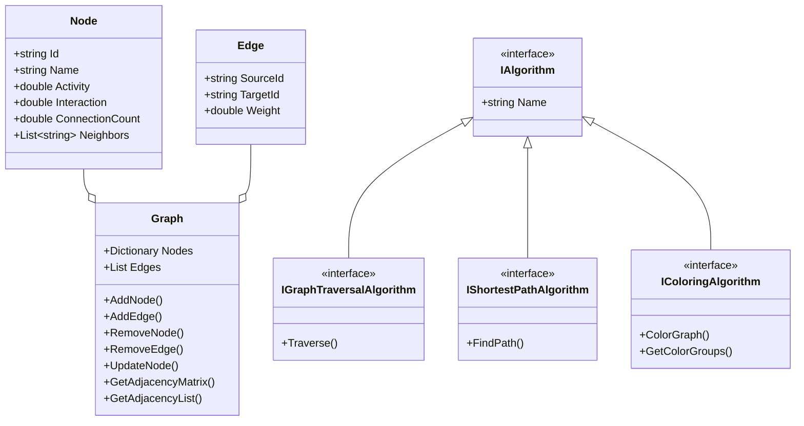

### Proje Yapısı

```
📦 SocialNetworkAnalysis
├── 📂 SocialNetworkAnalysis.Core/      # İş mantığı katmanı
│   ├── 📄 Node.cs                      # Düğüm modeli
│   ├── 📄 Edge.cs                      # Kenar modeli
│   ├── 📄 Graph.cs                     # Graf veri yapısı
│   ├── 📄 IAlgorithm.cs                # Algoritma arayüzleri
│   ├── 📄 BfsAlgorithm.cs              # BFS implementasyonu
│   ├── 📄 DfsAlgorithm.cs              # DFS implementasyonu
│   ├── 📄 ShortestPathAlgorithm.cs     # Dijkstra algoritması
│   ├── 📄 AStarAlgorithm.cs            # A* algoritması
│   ├── 📄 CentralityAlgorithm.cs       # Merkezilik analizi
│   ├── 📄 ConnectedComponentsAlgorithm.cs  # Bağlı bileşenler
│   ├── 📄 WelshPowellColoringAlgorithm.cs  # Graf renklendirme
│   ├── 📄 WeightCalculator.cs          # Dinamik ağırlık hesaplama
│   ├── 📄 FileService.cs               # CSV dosya işlemleri
│   └── 📄 JsonFileService.cs           # JSON dosya işlemleri
│
├── 📂 SocialNetworkAnalysis.UI/        # Kullanıcı arayüzü katmanı
│   ├── 📄 MainWindow.xaml              # Ana pencere tasarımı
│   ├── 📄 MainWindow.xaml.cs           # Ana pencere mantığı
│   ├── 📄 NodeDialog.xaml              # Düğüm ekleme/güncelleme dialogu
│   ├── 📄 EdgeDialog.xaml              # Kenar ekleme/silme dialogu
│   └── 📄 App.xaml                     # Uygulama ayarları
│
├── 📂 SS/                              # Ekran görüntüleri
│   ├── 🖼️ Arayüz.png
│   ├── 🖼️ BFS.png
│   ├── 🖼️ DFS.png
│   ├── 🖼️ Dijkstra.png
│   ├── 🖼️ A'.png
│   ├── 🖼️ Merkez.png
│   ├── 🖼️ Bileşen.png
│   └── 🖼️ Renk.png
│
├── 📄 test_small.csv                   # 20 düğümlük test verisi
├── 📄 test_medium.csv                  # 100 düğümlük test verisi
├── � TEST_SONUCLARI.md                # Detaylı test sonuçları
└── 📄 README.md                        # Bu dosya
```

---

## 🧮 Dinamik Ağırlık Hesaplama

Kenar ağırlıkları düğüm özelliklerine göre otomatik hesaplanır:

$$Weight_{i,j} = \frac{1}{1 + \sqrt{(A_i - A_j)^2 + (I_i - I_j)^2 + (C_i - C_j)^2}}$$

| Değişken | Açıklama |
|----------|----------|
| A | Activity (Etkinlik puanı) |
| I | Interaction (Etkileşim puanı) |
| C | ConnectionCount (Bağlantı sayısı) |

> **Not:** Benzer özelliklere sahip düğümler arasındaki ağırlık **daha yüksek** (daha güçlü bağ), farklı özellikli düğümler arasındaki ağırlık **daha düşük** olur.

---

## 📊 Test Sonuçları

### Performans Özeti

| Algoritma | 20 Düğüm | 100 Düğüm | Ölçeklenme |
|-----------|:--------:|:---------:|:----------:|
| **BFS** | 1-2 ms | 4-6 ms | ✅ Mükemmel |
| **DFS** | 1-2 ms | 4-6 ms | ✅ Mükemmel |
| **Dijkstra** | 2-3 ms | 15-25 ms | ✅ İyi |
| **A*** | 2-3 ms | 12-20 ms | ✅ İyi |
| **Merkezilik** | 1 ms | 3-5 ms | ✅ Mükemmel |
| **Bağlı Bileşenler** | 1-2 ms | 8-12 ms | ✅ İyi |
| **Welsh-Powell** | 3-4 ms | 25-40 ms | ✅ Kabul edilebilir |

### Hata Kontrolü

| Test Senaryosu | Durum |
|----------------|:-----:|
| Aynı ID'li düğüm ekleme | ✅ Engellendi |
| Self-loop oluşturma | ✅ Engellendi |
| Geçersiz düğüm ID'si ile kenar | ✅ Hata mesajı |
| Tekrarlanan kenar ekleme | ✅ Engellendi |
| Boş ID ile düğüm ekleme | ✅ Kontrol edildi |

> 📋 **Detaylı sonuçlar:** [TEST_SONUCLARI.md](TEST_SONUCLARI.md)

---

## 🎨 Algoritma Renk Kodları

| Algoritma | Renk | Açıklama |
|-----------|------|----------|
| **BFS** | 🔵 Mavi | Ziyaret edilen düğümler |
| **DFS** | 🟢 Yeşil | Ziyaret edilen düğümler |
| **Dijkstra** | 🟠 Turuncu | Bulunan en kısa yol |
| **A*** | 🟠 Turuncu | Bulunan en kısa yol |
| **Merkezilik** | 🟡 Sarı | En merkezi 5 düğüm |
| **Bileşenler** | 🟣 Mor | İlk bağlı bileşen |
| **Renklendirme** | 🎨 Çoklu | Komşu olmayan gruplar |

---

## 🔮 Gelecek Geliştirmeler

- [ ] Force-directed layout algoritması
- [ ] Zoom ve pan özellikleri
- [ ] Betweenness/Closeness centrality
- [ ] Louvain topluluk tespiti
- [ ] Animasyonlu algoritma görselleştirme
- [ ] Büyük veri optimizasyonları
- [ ] Graf veritabanı entegrasyonu

---

## 📚 Kaynaklar

### Algoritmalar
- [Introduction to Algorithms (CLRS) - MIT Press](https://mitpress.mit.edu/books/introduction-algorithms-fourth-edition)
- [Dijkstra's Algorithm - GeeksforGeeks](https://www.geeksforgeeks.org/dijkstras-shortest-path-algorithm-greedy-algo-7/)
- [A* Search Algorithm - Red Blob Games](https://www.redblobgames.com/pathfinding/a-star/introduction.html)
- [BFS and DFS Traversal - Programiz](https://www.programiz.com/dsa/graph-bfs)
- [Graph Coloring - Brilliant.org](https://brilliant.org/wiki/graph-coloring-and-chromatic-numbers/)

### Sosyal Ağ Analizi
- [Social Network Analysis - Stanford University](https://snap.stanford.edu/)
- [Network Analysis with Python - NetworkX Documentation](https://networkx.org/documentation/stable/)

### Teknoloji
- [.NET Documentation - Microsoft](https://docs.microsoft.com/dotnet/)
- [WPF Documentation - Microsoft](https://docs.microsoft.com/dotnet/desktop/wpf/)
- [C# Programming Guide - Microsoft](https://docs.microsoft.com/dotnet/csharp/programming-guide/)

